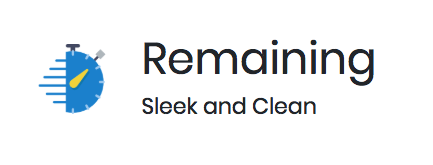
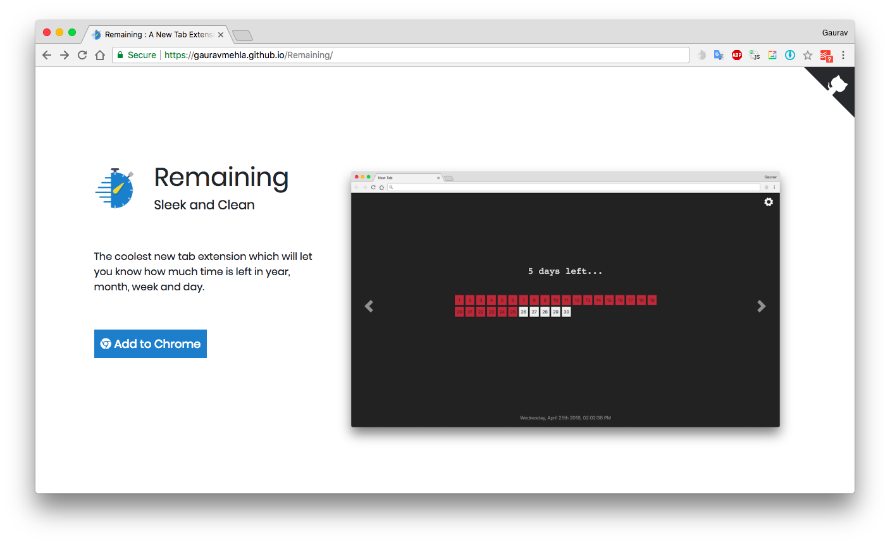

<h1 align="center"></h1>

The coolest new tab extension which will let you know how much time is left in year, month, week or day.

## How to build

- Clone this repository and run `npm install`
- Start the development server using

```
npm start
```
- In order to make a build of your app, execute

```
npm run build
```


Want to know more, visit this [link](https://github.com/facebook/create-react-app/blob/master/packages/react-scripts/template/README.md)

> To try built Chrome extension, you should go to `chrome://extensions` and press the button "Load unpacked extension" and select the `build` folder.

## Technologies and Libraries Used

#### For building application

<h1 align="center"></h1>

- [Create-react-app](https://github.com/facebook/create-react-app)
- [Reactstrap](https://reactstrap.github.io/)
- [MomentJS](https://momentjs.com/)
- [React-calender-heatmap](https://www.npmjs.com/package/react-calendar-heatmap)
- [React-color][https://casesandberg.github.io/react-color/] :heart:

#### For landing page

<h1 align="center"></h1>

- [Bootstrap v4](https://github.com/twbs/bootstrap)
- [Font-Awesome](http://fontawesome.io/)

## Inspiration

- [Progress Bar OSX](https://www.producthunt.com/posts/progress-bar-osx)
- [Year Progress](https://chrome.google.com/webstore/detail/year-progress/hmejblemllciaklhffpinjgkbngcoopb)

## Licence

MIT License

Copyright (c) 2018 Gaurav Mehla

<div>Icons made by <a href="https://www.flaticon.com/authors/smashicons" title="Smashicons">Smashicons</a> from <a href="https://www.flaticon.com/" title="Flaticon">www.flaticon.com</a> is licensed by <a href="http://creativecommons.org/licenses/by/3.0/" title="Creative Commons BY 3.0" target="_blank">CC 3.0 BY</a></div>


